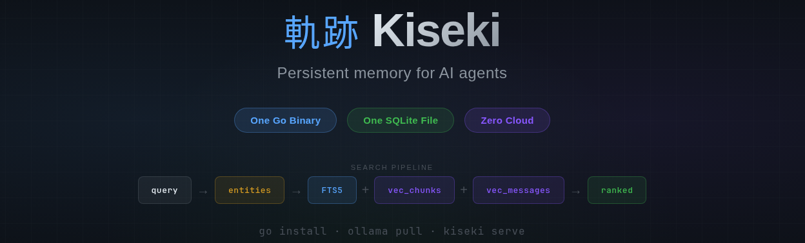
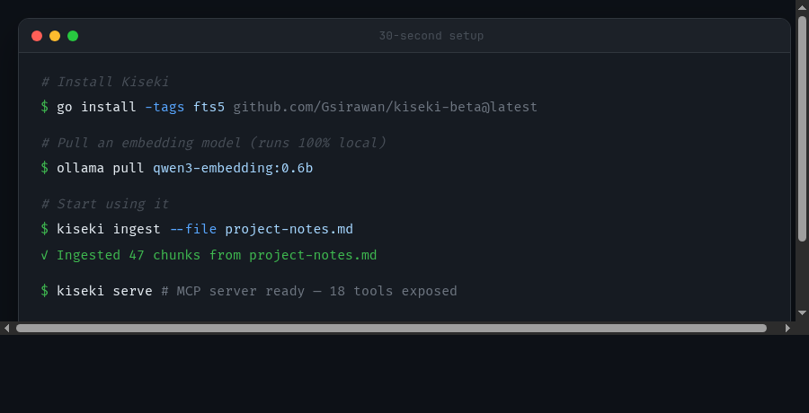
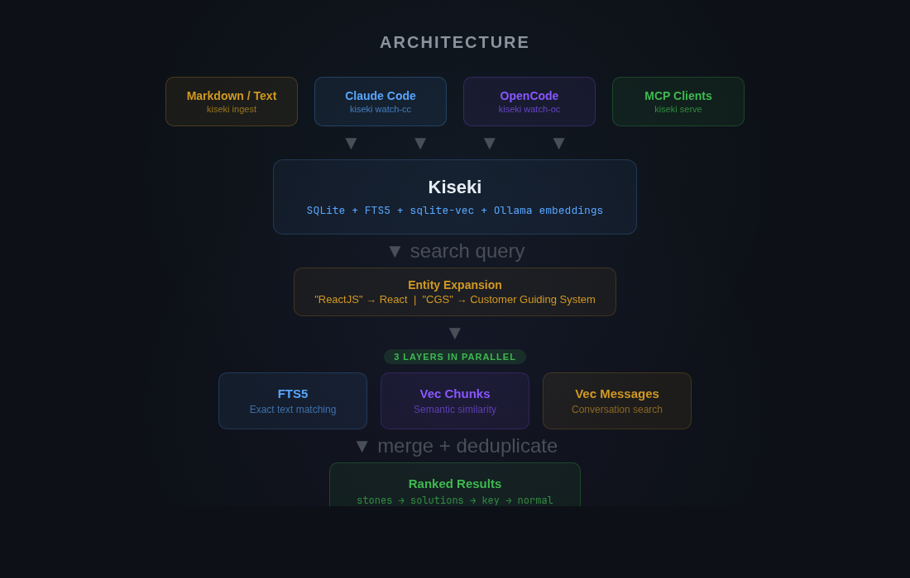
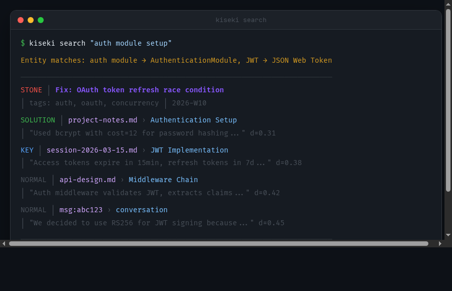

<p align="center">
  
</p>

<p align="center">
  <a href="https://github.com/Gsirawan/kiseki-beta/actions/workflows/ci.yml"></a>
  <a href="https://github.com/Gsirawan/kiseki-beta/releases"></a>
  <a href="https://github.com/Gsirawan/kiseki-beta/blob/main/LICENSE"></a>
  
</p>

---

Your AI assistant forgets everything between sessions. Every conversation starts from zero. Every decision re-explained. Every solution re-discovered.

**Kiseki gives your AI persistent memory.** Ingest conversations, notes, and documents. Search them with a real retrieval pipeline. Your AI remembers what you built, what you decided, and why.

---

## Why Kiseki?

Most AI memory tools are either cloud-dependent, framework-heavy, or toy-grade. Kiseki is none of those.

| | **Kiseki** | **Mem0** | **Zep** | **Memento** | **Generic MCP Memory** |
|---|---|---|---|---|---|
| **Runs locally** | Yes | No (cloud API) | Partial | Yes | Varies |
| **Search layers** | 3 parallel (FTS5 + vec chunks + vec messages) | API-dependent | Episodic + semantic | FTS5 + sqlite-vec | Usually 1 |
| **Entity expansion** | Yes (YAML-defined aliases) | No | No | Knowledge graph | No |
| **Live session capture** | Yes (Claude Code + OpenCode) | No | No | No | No |
| **Importance tiers** | Yes (stone > solution > key > normal) | No | No | No | No |
| **Multi-instance** | Yes (prefix-based) | Separate accounts | Separate deployments | Single instance | No |
| **Cross-instance messaging** | Yes (agent mail) | No | No | No | No |
| **Weekly review pipeline** | Yes (mechanical scoring) | No | No | No | No |
| **Token shield pattern** | Yes (Gist subagent) | N/A | N/A | N/A | N/A |
| **Setup time** | 3 commands | Account + API key + infra | Docker + config | Build from source | Varies |
| **Cost** | $0 | Subscription | Self-hosted infra | $0 | Varies |
| **Dependencies** | Go binary + Ollama | Cloud service | PostgreSQL + Redis | SQLite | Varies |

---

## 30-Second Setup

```bash
# Install
go install -tags fts5 github.com/Gsirawan/kiseki-beta@latest

# Pull an embedding model
ollama pull qwen3-embedding:0.6b
# Ships with a small model for accessibility — runs on modest hardware.
# For better quality, swap to a larger model (e.g. qwen3-embedding:4b)
# and update EMBED_MODEL and EMBED_DIM in your .env.

# Done. Use it.
kiseki ingest --file your-notes.md
kiseki search "that auth fix from last week"
```

<p align="center">
  
</p>

Or download a prebuilt binary from [Releases](https://github.com/Gsirawan/kiseki-beta/releases).

---

## How It Works

Every search query passes through a real retrieval pipeline:

<p align="center">
  
</p>

Three layers run **in parallel**, not sequentially. Results from all layers are merged, deduplicated, and ranked by importance tier. Chunks found by multiple layers rank higher.

---

## Features

### Multi-Layer Search

Not a single vector lookup. Three search strategies running simultaneously.

<p align="center">
  
</p>

### Live Session Capture

Your AI builds memory *while you work*. No manual export. No copy-paste.

```bash
# Watch a Claude Code session in real-time
kiseki watch-cc --project myproject

# Watch an OpenCode session
kiseki watch-oc --project-dir /path/to/project

# Messages are chunked, embedded, and stored as they happen
```

Both watchers support **note extraction** -- automatically saving subagent outputs as structured markdown files:

```bash
kiseki watch-oc --notes ~/notes --project-dir /path/to/project --notes-agent researcher
```

### MCP Server

Drop-in integration with any MCP client. Your AI gets memory via tool calls.

```json
{
  "mcpServers": {
    "memory": {
      "command": "kiseki",
      "args": ["serve"],
      "env": {
        "KISEKI_DB": "/path/to/memory.db",
        "KISEKI_PREFIX": "memory",
        "EMBED_MODEL": "qwen3-embedding:0.6b"
      }
    }
  }
}
```

`KISEKI_PREFIX` controls tool naming. Set it to `memory` and your tools become `memory_search`, `memory_ingest`, `memory_history`, etc.

**18 MCP tools exposed:** `search`, `search_msg`, `ingest`, `history`, `mark`, `status`, `list`, `forget`, `stone_add`, `stone_search`, `stone_read`, `stone_list`, `stone_delete`, `get_context`, `report`, `send`, `receive`.

### Multi-Instance

Run separate memories for separate concerns. Same binary, different databases.

```json
{
  "mcpServers": {
    "work": {
      "command": "kiseki",
      "args": ["serve"],
      "env": {
        "KISEKI_DB": "/data/work.db",
        "KISEKI_PREFIX": "work"
      }
    },
    "personal": {
      "command": "kiseki",
      "args": ["serve"],
      "env": {
        "KISEKI_DB": "/data/personal.db",
        "KISEKI_PREFIX": "personal"
      }
    }
  }
}
```

Now your AI has `work_search` and `personal_search` as separate tools. Different memories. Different scopes. Same binary.

### Entity Graph

Define entities with aliases. Search expands aliases automatically — query for any alias and Kiseki finds all chunks matching the canonical name.

```yaml
# entities.yaml
entities:
  - name: React
    aliases: [ReactJS, react.js]

  - name: "Project Alpha"
    aliases: [PA, alpha]

  - name: PostgreSQL
    aliases: [postgres, pg]
```

```bash
$ KISEKI_ENTITIES=entities.yaml kiseki search "ReactJS performance"
# Expands to search for "React" across all layers
# Entity matches: ReactJS → React
```

### Stones

Named records for solutions and decisions. Permanent, searchable, categorized.

```bash
# Record a solution
kiseki stone add \
  --title "Fix: OAuth token refresh race condition" \
  --category fix \
  --tags "auth,oauth,concurrency"

# Find it later
kiseki stone search "oauth"
kiseki stone list --week 2026-W12
```

Stones rank above all other results in search. Your critical solutions always surface first.

### Importance Marks

Tag any chunk or message with a priority tier. Search respects the hierarchy.

```bash
kiseki mark message msg_abc123 solution   # Highest priority
kiseki mark chunk 42 key                  # Elevated priority
# Unmarked chunks default to "normal"
```

**Tier ranking:** `stone > solution > key > normal`

### Weekly Review

End-of-week pipeline to surface solutions from conversation history. Mechanical pattern detection, not LLM judgment.

```bash
kiseki review --week 2026-W12

# Scores chunks by signals:
#   Code block after long discussion?  +2
#   Contains "fixed", "worked"?        +1
#   Last messages in session?          +2
#   File path + code block?            +2
#
# Score >= 4 → marked "solution"
# Score >= 2 → marked "key"
```

```bash
# Generate a report of what was accomplished
kiseki report --week 2026-W12
kiseki report --from 2026-03-16 --to 2026-03-22 --format text
```

### Agent Mail

Message passing between Kiseki instances. Cross-agent communication without shared databases.

```bash
# Instance A (prefix: "work")
KISEKI_MAIL_IDENTITY=work
KISEKI_MAIL_PEERS=research
KISEKI_MAIL_DIR=/shared/mail

# Instance B (prefix: "research")
KISEKI_MAIL_IDENTITY=research
KISEKI_MAIL_PEERS=work
KISEKI_MAIL_DIR=/shared/mail

# AI in instance A calls: work_send("Check the auth module")
# AI in instance B calls: research_receive() → gets the message
```

### Gist: The Token Shield

When your primary AI (expensive model) needs memory, don't let raw chunks flood its context. Spawn a Gist subagent on a cheaper model instead.

```
Primary Model (Opus/GPT-4.1)        Gist Subagent (Haiku/GPT-4.1-mini)
       │                                      │
       ├─ "search for auth discussion" ──────►│
       │                                      ├─ kiseki_search("auth module")
       │                                      ├─ kiseki_search("authentication")
       │                                      ├─ kiseki_search("JWT login")
       │                                      └─ returns structured summary
       │◄──── clean 500-token summary ────────┘
       │
       └─ continues reasoning with context
```

**~9,000 raw tokens compressed to ~500.** At your expensive model's per-token rate, this adds up fast.

Full setup: [docs/GIST.md](docs/GIST.md) | Agent prompt: [agents/gist.md](agents/gist.md)

---

## Configuration

| Variable | Default | Description |
|---|---|---|
| `KISEKI_DB` | `kiseki.db` | Database file path |
| `OLLAMA_HOST` | `localhost:11434` | Ollama server address |
| `EMBED_MODEL` | `qwen3-embedding:0.6b` | Embedding model name |
| `EMBED_DIM` | `1024` | Embedding dimensions |
| `KISEKI_PREFIX` | `kiseki` | MCP tool name prefix |
| `KISEKI_ENTITIES` | -- | Path to entities YAML file |
| `USER_ALIAS` | `User` | Human name in watcher output |
| `ASSISTANT_ALIAS` | `Assistant` | AI name in watcher output |
| `KISEKI_MAIL_IDENTITY` | -- | This instance's mail identity |
| `KISEKI_MAIL_PEERS` | -- | Comma-separated peer identities |
| `KISEKI_MAIL_DIR` | -- | Shared directory for mail files |
| `KISEKI_TYPOS` | -- | Path to typo normalization rules |
| `KISEKI_BACKUP_DIR` | -- | Text backup directory (safety net) |
| `KISEKI_NOTES_DIR` | -- | Directory for extracted notes |
| `KISEKI_NOTES_AGENT` | -- | Agent name to extract notes from |

Config loads from `.env` in the working directory, then `~/.config/kiseki/.env`.

---

## All Commands

```
kiseki ingest       Ingest files (markdown, text, stdin)
kiseki search       Multi-layer search (entity + FTS5 + vectors)
kiseki search-msg   Search messages with conversation context
kiseki history      Chronological entity mentions
kiseki status       Health check + database stats
kiseki serve        Start MCP server (18 tools)
kiseki watch-oc     Live capture — OpenCode sessions
kiseki watch-cc     Live capture — Claude Code sessions
kiseki batch-oc     Batch export OpenCode sessions
kiseki batch-cc     Batch export Claude Code sessions
kiseki stone        Manage solution/decision records
kiseki mark         Set chunk/message importance tier
kiseki review       Weekly review — mechanical scoring
kiseki report       Generate weekly activity report
kiseki list         Show ingested files + chunk counts
kiseki forget       Remove chunks (by file, date, or all)
kiseki re-embed     Re-embed all vectors (after model change)
kiseki migrate      Import from legacy databases
```

---

## Build from Source

```bash
git clone https://github.com/Gsirawan/kiseki-beta.git
cd kiseki-beta
go build -tags fts5 -o kiseki .
```

**Requirements:** Go 1.23+, Ollama running with an embedding model, GCC (for SQLite CGo compilation).

> **Note:** Windows is not currently supported due to CGo/SQLite dependencies. Linux and macOS are the supported platforms.

---

## OpenCode Plugin

Kiseki ships with a [plugin for OpenCode](plugins/opencode/) that adds:

- **Foundation injection** -- auto-inject identity/context files into every system prompt
- **Time awareness** -- current time, period of day, Hijri calendar, Ramadan detection
- **Dynamic reminders** -- live-reloading reminder file with filesystem watch
- **Session briefing** -- auto-summarize compacted sessions
- **Cross-agent mail notifications** -- toast + system prompt nudge for unread messages

See [plugins/opencode/README.md](plugins/opencode/README.md) for setup.

---

## Stats

- **~16K lines of Go** across 18 internal packages
- **8 direct dependencies** (sqlite-vec, lipgloss, misspell, uuid, godotenv, go-sqlite3, go-sdk, yaml.v3)
- Single binary, single SQLite file, zero cloud services

---

## Philosophy

Kiseki exists because simple tools that work beat complex frameworks that impress.

There is no microservice architecture. No message queue. No container orchestration. No dashboard. No account system. No telemetry. No "enterprise tier."

There is a Go binary that reads and writes a SQLite file. It searches with three layers because one layer isn't good enough. It watches your sessions because manual export is friction that kills adoption. It runs on your machine because your memory is yours.

The name means *trajectory* -- the track left behind as you move forward. Your AI should be able to look back and see where you've been.

---

## License

[MIT](LICENSE)
